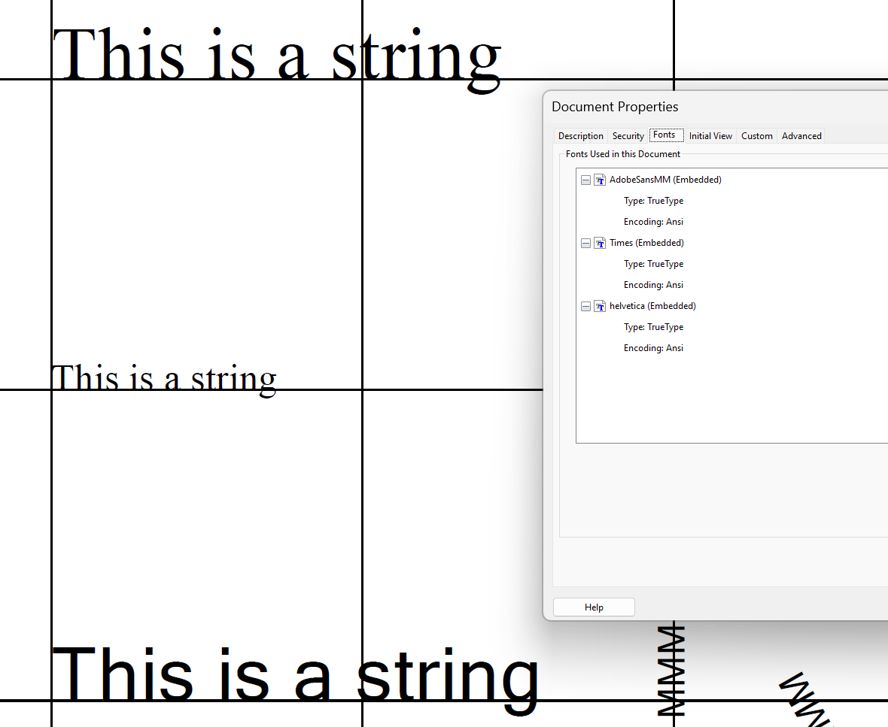

# to do

## v0.0.51 2024-10-08
* Update: clip line and axis sticks

## v0.0.50 2024-10-02
* Fix bugs

## v0.0.49 2024-10-02
* Update: supports hex color

## v0.0.48 2024-02-27
* Fix: z_index of plot area

## v0.0.47 2024-02-27
* Fix: bugs in plotting rect with fill color

## v0.0.46 2024-02-16
* Fix: problem in xref and length of content streams, now files can be opened with CorelDRAW.
[Thanks KJ's help](https://stackoverflow.com/a/78007842/22143697)

## v0.0.45 2024-02-14 
* Add a color template including ten colors

## v0.0.44 2024-02-11 
* Add line caps for drawing lines, square and butt caps are supported.

## v0.0.43 2024-02-11 
* Fix the error of clipping lines outside of plot areas.

## v0.0.42 2024-02-10 
* Fix the issue of font file path error in Ubuntu system.

## v0.0.41 2024-02-10 
* Revise setup.py, fixed the issue of missing resource files.

## v0.0.40 2024-02-10 
* Fix text wrapping error
* The issue of displaying unicode characters should be related to the encoding method, which is WinAnsiEncoding
as default. WinAnsiEncoding is similar to ASCII code. To support unicode characters, perhaps it is needed to 
use Composite Fonts (CIDFont), compared to Simple Fonts, they require more dictionaries to define.

## v0.0.39 2024-02-10 
* Issue found: plus-minus sign cannot be displayed correctly.

This issue seems to be caused by the encode procedure, for example, the character "±" (unicode 00B1) will
be converted to b'\xc2\xb1' with encode('utf-8'). Thus I found only characters between 0 to 127 in ASCII set 
can be displayed correctly.
    
    s = "=±=≤"
    for i in s:
        print(i.encode('utf-8'))
        
    b'='
    b'\xc2\xb1'  # this is converted by "±" but will convert to "±".
    b'='
    b'\xe2\x89\xa4'  # this is converted by "≤" but will convert to "â\x89¤".
    
    # for example:
    s = "±"
    s.encode('utf-8')
    # b'\xc2\xb1'
    b'\xc2\xb1'.decode('utf-8')
    # "±"
    # Up to here, everything is good, however if convert bytes to hexadecimal representation, errors happed
    b'\xc2\xb1'.hex()
    # 'c2b1'
    #  convert bytes to charaters, will give chr(0xc2) and chr(0xb1) 
    # delete the first two digits, i.e., only 'b1' left, then display "±" well.   

Now we can successfully write the symbol "±", but fail to display other characters in Unicode set with longer 
codes, such as "≤" (unicode 8804). Currently I dont exactly know how to completely solve this issue, and I tried
to use ASCII85Decode but not helpful. I'll evaluate if it is necessary to search deeper to find the perfect 
solution to support more Unicode characters.
    
## v0.0.38 2024-02-10 
* Fix the display error of double quotation marks, which was missed in the subset font files.

## v0.0.37 2024-02-10 
* Note that font name should be postScriptName of a font, i.e., BaseFont attribute in Font object, and 
FontName attribute in FontDescriptor object, otherwise, some pdf reader like Chrome Browser can read it 
correctly, but Adobe Acrobat will show warning and replace by other built-in fonts.

## v0.0.36 2024-02-10 
* Fix the error of embedding fonts.

Source font file size:

Extracted font file size:

There is a difference of 4 bytes. The extracted file missed four charachters. So the issue might happen 
during the hex encoding procedure.

Furtherly, it is noticed that the difference happens after the realignment of the hexadecimal representation, 
in which errors might happen.

Finally identify the issue: should be len(hex_stream) // 64 instead of that + 1.

Three fonts are all embedded.

## v0.0.35 2024-02-09 
* Add multiply fonts to pages. 
* TrueType fonts like Arial are displayed well now, but Type 1 font don't work well.
Possible reason: comparing extracted font file by pdf-parser.py from the pdf and the source file times.ttf,
it is found that extracted font file lost some information. Times ttf might be not TrueType font.

## v0.0.34 2024-02-09 
* Try to solve the embedding issue, some potential problems found: length calculation of the font file 
stream.
* A javascript module named [fontsubset](https://github.com/flashlizi/fontsubset) can be used to extract 
subset from a full font file so the size of pdf with embedded font files can be decreased. 
Usage: fontsubset -s "String containing characters might be included" fontFile outputFile

## v0.0.33 2024-02-08 
* Add rotation attribute for text item (might also work for other items like rect).
* Change the priorities of three rich text tags, now color > super/subscript > break. That means
<red>ABCD<r>EF<red> is allowed, but AB<red>CD</red> will be not displayed correctly.
And these tags should not separate others, like <red>CD</red>, which will be displayed wrong.

## v0.0.32 2024-02-08 
* Try to embed font files into the Font Descriptor objects. 
[This answer](https://stackoverflow.com/a/76125971/22143697) show an example of embedding font files, 
his pdf works well in Adobe Acrobat. But I failed to do this, still trying to fine why.
* For reference, [This answer](https://stackoverflow.com/a/3489099/22143697) introduced how to extract
font info from a pdf file. 
* This issue haven't been solve.

## v0.0.31 2024-02-07 
* Fix font issue, currently Arial font works well, Adobe can successfully recognize the texts,
but other fonts may not work for Adobe Acrobat. Adobe Illustrator can work well for all fonts.
* Add auto middle alignment for tests.
 
## v0.0.3 2024-02-07 
* Add other attributions such as FontDescriptor in the Font object.
* Read font information from xml files, and embed them into the pdf.
* A horizontal scale (integer) will be used to control the actual widths of characters, default 0.5.

## v0.0.2 2024-02-05 
* Add canvas

## v0.0.1 2024-02-04 
* First release
* Basic functions: Create a PDF, add text, lines and scatters. Supports superscript
 and subscript and different color in one string.
